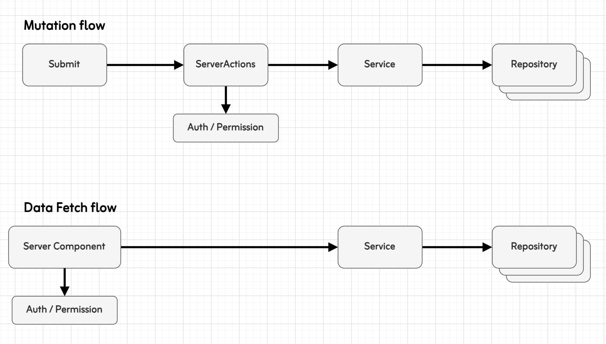

# Next.jsベタープラクティス

このドキュメントはNext.jsを使った開発をする際に、ガイドラインを示すことで開発チームの中で書き方のばらつきを抑え、保守性を保つことを目的としています。ベストな設計を追求するよりも現実的な利益を得られるバランスを目指しています。

## ライブラリ

今回のリポジトリでは以下のライブラリを利用する

- Prisma（Drizzleでも良い）
- Zod（Valibotでも良い）

### 推奨ライブラリ

- UI
  - React Aria Component
  - Storybook
  - Tailwind CSS
- 認証
  - Better Auth
  - もしくはAuth0
- Worker
  - BullMQ
- テスト
  - Vitest
  - MSW
- Linter / Formatter
  - Biome
  - SecretLint
- その他
  - dotenvx
  - T3-Env
  - pino + next-logger
  - Sentry

### ライブラリ選定

- 依存ライブラリ数は少なくなるよう努力する
  - 依存が少ないと保守コストの削減とセキュリティリスクの低減になる
- ちょっとした機能であればライブラリではなく自前で用意する
- ただし複雑であり再発明と保守コストが高い場合はライブラリを使う
  - 例：高機能UIライブラリ

## レイヤー方針

- データを中心としたレイヤーは主に2階層にする

  - Repository

  - Service ( or UserCase )

- データ操作 ( Mutation / DataFetch ) を行うのは以下の2つ

  - MutationはServer Actions
  - DataFetchはServer Component
  - UIとしてClientにせざるをえないケースではClient ComponentからDataFetchも例外で認め
    - 例：無限スクロール・続きを読む・並び替え

### レイヤー構成図



### ディレクトリ構成例

- `/sample` ページの構成例
  - ServerActionsは `_actions` ディレクトリに配置
  - コンポーネントは `_components` ディレクトリに配置
- 全体で利用するコンポーネントは `src/components` に配置

```
app
└── components
    └── Card.tsx
└── sample
    ├── _actions
    │   └── createSample.ts
    ├── _components
    │   └── CreateSampleForm.tsx
    └── page.tsx
```

### Repository

- DB操作や外部APIはRepository層を作る
  - Repository層ではDBや外部APIなどを直接操作する
  - RepositoryはDTOの役割も担っているため、SELECTのフィールドは必要最低限なものを明示的に指定
  - 関数を増やすのではなく汎用的なインターフェイスとする
  - また関連テーブルがあり、利用ケースとして結合したほうが良ければRepositoryでするのはOK
    - 例：ブログ記事のカテゴリ情報は、原則一緒に利用するのでarticleRepo().find()ではカテゴリをJOINして返す
- Prismaの自動生成された型はそのまま利用せず、必要なフィールドを明示的に指定する

```ts
// 必要なフィールドを明示的に指定
const tagSelect = {
  id: true,
  name: true,
} satisfies Prisma.TagSelect;

// それを元に型情報を生成
type Tag = Prisma.TagGetPayload<{ select: typeof tagSelect }>;
```

- RepositoryではPrismaのトランザクションオブジェクトを受け取り、それを利用する
  - Repository自身ではトランザクション管理はしない
  - トランザクションはServiceの責務
- Repositoryは操作対象リソース単位のファイルとする
  - 例：UserRepository.ts / ArticleRepository.ts
- 関数名は list / find / create / update / delete をベースとする
- 効率を上げるために一括処理用の bulkCreate / bulkUpdate / bulkDelete などを作るのはOK
  - ただし、findById / findByEmail など関数が増え続けるような用途の狭い関数を作るのは禁止
  - なるべく汎用性の高い関数として設計をする
    - 例外として複雑度が上がるようであれば適宜関数を分割すること
- Prismaの `$queryRaw` でSQLを直接実行することもOK
  - その場合、必ず返り値をZodでパースすること
  - また実データを使ったテストコードも必ず書くこと


### Service

- ビジネスロジックはService層を作る
  - Service層ではDBトランザクションとビジネスロジックを表現（凝集度を高める）
  - Service層から必要なRepositoryを呼び出す
- Serviceは関数単位のファイルとする
  - 例：createUserService.ts / deleteArticleService.ts
  - また、ファイル名・関数名の最後にはServiceというSuffixを加える
- 関数名はユースケースとして分かりやすい命名にする（長すぎるのは駄目）

### Mutation: ServerActions

- ミューテーションはServerActionsを利用する
  - ServerActionsでは認証認可・データバリデーション（パース）・Service呼び出し、レスポンスを行う
  - ServerActionsから直接Repositoryは呼ばない
- ServerActionsではビジネスロジックは記述しない
  - ビジネスロジックはServiceに任せる
- ServerActionsは、MVCでいうところのControllerのような立ち位置で考える
  - ユーザからの入力を受け取り、必要なデータクレンジングをし、処理を呼び出し、レスポンスを返す
- ServerActionsの引数は原則FormDataで統一する
  - `useActionState` と組み合わせて使うこと
  - 「いいね」などの機能の場合はボタンクリックでServerActionsを動かすためFormDataではなく任意の値でOK
- ServerActionsはFormの `action` で呼び出す `<Form action={action}>` 
  - Formの `onSubmit` は利用禁止
  - 「いいね」などの機能の場合は `onClick` で呼び出すのはOK
- 必要に応じて完了後に画面更新をするため `revalidatePath` を使う
- ファイルは関数単位で分割すること
  - ファイル名は関数名と同じに統一すること
  - 例：`createUser.ts` `function createUser()`


### Data Fetch: Server Component

- 必要な情報は最上位のPageComponentでService関数から取得する
- ネストが深いコンポーネントだけに必要なデータは、該当コンポーネント自身でデータ取得する
  - この際、多くはClientComponentになっている。そのため直接Service関数は実行できない
  - その場合は、素直に `fetch` 相当の処理をしてもOK
    - ServerActionsでもデータフェッチは可能だがパフォーマンス上の懸念があるので使いすぎには注意（使うことはOK）
    - ただし原則はServer ComponentからPropsで渡すのを守ること

## エラーと例外

- 原則、RepositoryとServiceではエラー時には例外を投げる
- 利用する側（ServerActionsなど）で `try..catch` し適切なエラーハンドリングをする
- いわゆるResult型は利用しない

## Component

### ディレクトリ構成・ファイル名

- Colocationの考え方を尊重する
  - 1つの画面（機能）で使うファイルは、同じ場所に配置する
  - Server Actionsは `_actions` ディレクトリに配置する
  - コンポーネントは `_components` ディレクトリに配置する
    - もし、複数の画面で利用するようなケースがあれば、トップディレクトリ `src/components` に配置する
  - このルールはRepositoryとServiceは該当しない（この2つはトップディレクトリ配置）
- ファイル名は関数名と同じにする
  - つまりcamelCaseで作成する（例：createUser.ts）
  - コンポーネントの場合はUpperCamelCaseとなる（例：UserList.tsx）
- コンポーネントはなるべく小さく分割する
  - 再レンダリングの影響範囲を小さくできる
  - 小さくしすぎると保守が大変になるので意味のある単位にすること

### Layout / Page Component

- PropsはNext.js v15.5から提供されたPage Props Helperを利用する
  - SearchParamsに関してはZodでスキーマ定義し、必ずパースしてから利用する
- Page Componentは必ずServer Componentにする
  - もしClientにする必要があれば別コンポーネントに切り出す

### Client Component

- クライアント側の状態管理は極力しない
  - 状態管理ライブラリも導入しない
  - クライアント側の状態が管理が複雑になればなるほど、開発がつらくなる
- `useState` `useEffect` `useRef` を書かざるをえないときは立ち止まって設計を見直す
  - 素朴な処理であれば書かずとも表現できることが多い
  - ただし、使うのが悪ではないので必要であればOK

### レイアウト用コンポーネント

- 一つの単位のでレイアウトを複数のコンポーネントで表現する時の作法
  - 例えばカードやページレイアウトなど
- `<Card>` という親をトップに、`<Card.Header>` `<Card.Content>` など子を用意する

```tsx
<Card>
  <Card.Header>Card</Card.Header>
  <Card.Content>Content</Card.Content>
</Card>
```

- `renderProps` は使っても良いが、基本はコンポーネントを分割してレイアウトさせる

```tsx
// renderPropsの多用は避ける（禁止ではない）
<Card title={<div>Card</div>} content={<div>Content</div>} />
```

- レイアウトする際にはTypeScriptのNameSpace機能を使う
  - NameSapaceを使うことでIDEでコード移動がサポートされる

```tsx
export function Card(){}
export namespace Card {
  export function Header(){}
  export function Content(){}
}
```

### コンポーネントのスタイリング

- 原則、共通UIコンポーネントにスタイリングは任せる
  - 似てるけど微妙に異なるデザインがあったら、デザイナーと相談し統一する
  - その場所でしか使わないデザインに限り、その場でスタイリング可能
- 共通UIコンポーネントの拡張スタイルは閉じるのを原則とする
  - 共通UIコンポーネントに外部から自由にスタイルを拡張できると制御不能になる

## 認証・認可

- 認証と認可は、必ずPageComponentで行う
  - Layoutでセッション情報を取得して特定の処理をすること自体はOK
  - ただし、Layoutのみで制御するのは禁止
  - 必ず該当ページでチェックをすること
- また、ServerActions・RouteHandlerでも必ず認証・認可を確認すること
- MiddlewareでログインチェックすることはOKだが、これも補助的に捉える
- 認証と認可のチェックは汎用的な共通関数を用意すること
  - ロジックが分散することを防ぐ
  - 例
    - `requireLogin()` : 認証済み確認
    - `hasPermission({ リソース, アクション, セッション })` : 操作可能か
- 悩み：認可はService関数内部でチェックするようにしても良いが…
  - ドメイン的には認可は不変条件なのでServiceで処理するのが自然
  - ただ、Service自体はユーザ関係なくバッチ処理などでシステム利用されるケースもある
  - 今のところEndpoint側で認可の責務を持つほうが分かりやすく、汎用性が高いと考えている

## Next.js / React

### Parallel Routes / Intercept Routes

- 非常に強力な機能なためうまく使えたら効果的
- 特にParallel Routesはコンポーネントのネスト状況に依存せず、Server Componentとして切り出せるので、モーダルなど複雑なUIがでてきたときに非常に便利
- ただし、ディレクトリ配置や `default.tsx` などの概念を理解するのが難しく、誰でも簡単に使えるわけではない、多用に注意

### useMemo / useCallback

- `useMemo` `useCallback` は利用禁止
  - 将来的にReact Compoilerで自動的にパフォーマンス改善の対象となる
  - また、ほとんどのケースでは利用しても体感パフォーマンスは変わらない
  - なのにコード上は複雑性が上がる
- 大量データかつ計算コストが高いと判断できるときだけ利用可能

## Prisma

- `$extends` は使用しない
  - モデルオブジェクト相当の表現ができる強力な機能
  - だが、拡張をしていくに連れ型推論が複雑になり、PrismaClientの取り回しが難しくなったりする
  - 型パズルを頑張る必要が出てきて本質的じゃない壁がでてくるので利用しない

## TypeScript

### コードの書き方

- 型推論に頼らず型は明示的に書くようにする
  - 特に関数の返り値は明示的に書くことで意図せぬ不具合を予防できる
  - 変数定義の型指定もしたほうが良いが、明らかな場合は省略して良い
    - 例： `const foo = 'string'` こういうのはしなくてよい
    - 複雑なオブジェクトの場合は `satisfies` の利用もする

- `class` は禁止
  - classを使い始めると状態管理をしたくなってしまう
  - ステートレスなWebアプリにおいて状態管理が有効なシーンは限定的

- `let` は禁止
  - もし `if-else` などで代入する値が違う場合は、処理を関数に切り出して `let` ではなく `const` にする


## テスト方針

- 原則：モックは極力利用しない方針
- Repository
  - 本物のDBとデータを使ってテストする
    - ただし、外部APIの場合はMSWを使ったモックを利用する
  - テスト重要箇所：クエリロジックやSQLが正しいかチェック
- Service
  - 本物のDBとデータを使ってテストする
  - Repositoryも本物の関数を呼び出す
  - テスト重要箇所：ビジネスロジックの仕様を表現し、正常系・異常系をチェック
  - 細かすぎるテストケースは作らず主要なテストケースに留める
- ServerActions
  - 本物のDBとデータを使ってテストする
  - テスト重要箇所：パラメータチェック・認証認可・エラーハンドリング
  - 細かすぎるテストケースは作らず主要なテストケースに留める
- 普通のComponent
  - テストコードを書くべきかどうかは迷っている
  - E2Eテストでカバーしたほうが良い気はしているがE2Eテストケースが増えるのは避けたい…
- 共通 UI Component
  - Storybookを用意し、インタラクションテストを書く
    - インタラクション要素が複雑でなければ書く必要はない
  - ビジュアルリグレッションテストは導入する価値はある
